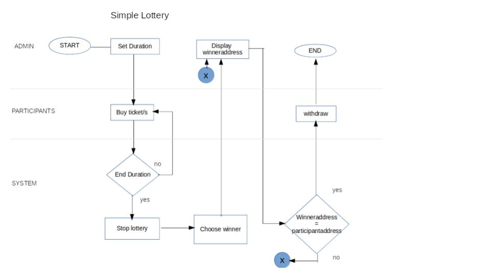
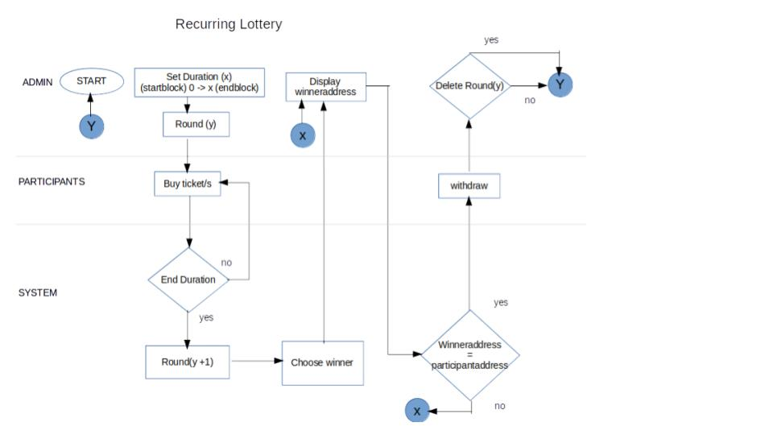
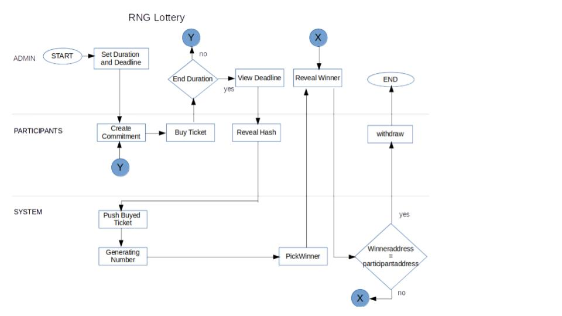
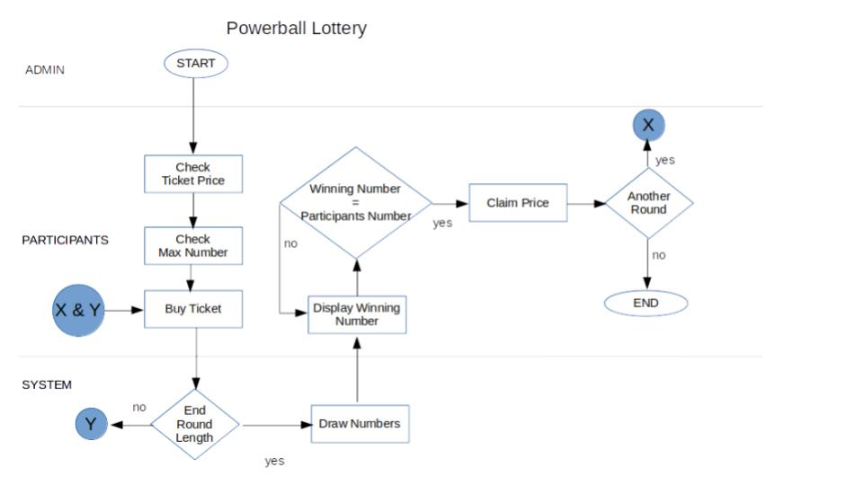

# Lottery

Hyperledger Lottery Game with Design Flow

## Simple Lottery

This contract is a short lottery game wherein the user will be given a randomly generated number upon buying a ticket.

Design flow:

## Recurring Lottery

This contract is similar to the Simple Lottery, however, in this section, there will be another round of game when the last round ended.

Design Flow:

## RNG Lottery

This contract uses the RNG system, wherein RNG means 'Random Number Generated', this lottery game is for a one time random number.

Design flow:

## Powerball

This contract based from a very famous lottery game in the world. This is a game of guessing numbers, wherein if the participant's guess matchess the generated numbers then they will win some of the ticket prize in accordance to the numbers that matched. 

**Design flow:**

